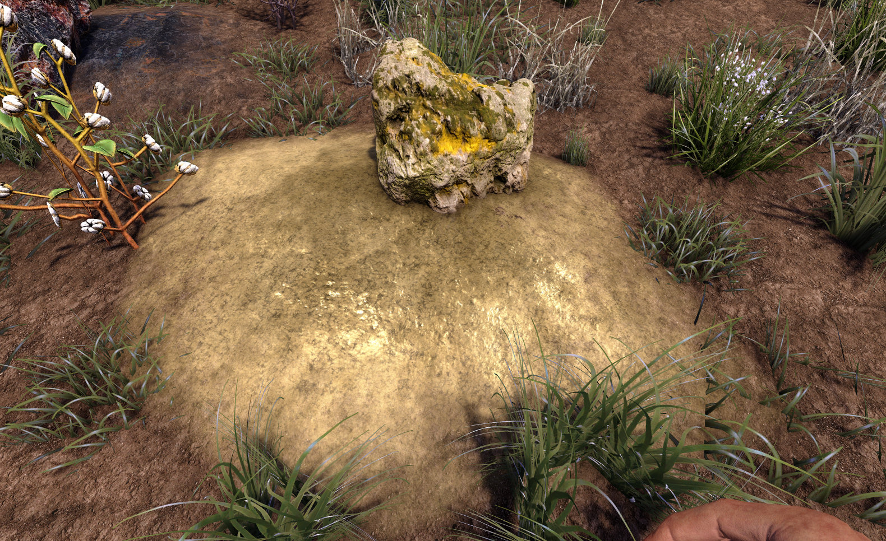
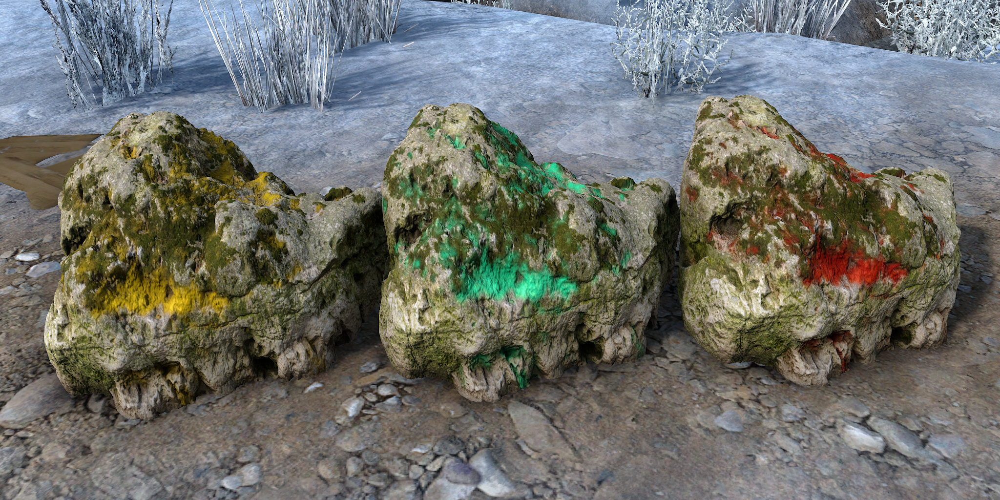

# OCB MicroSplat Ore Voxels Mod - Demo for OCB MicroSplat

Adds two demo ore blocks with custom textures.

Requires [OcbMicroSplat][1] (Download from [Nexusmods][3]).

The top boulder is tintable to be re-usable.

You need to disable EAC to use this mod!

## Changelog

### Version 0.2.1

- Add texture for lava emission map 
- Add textures for metallic iron ore
- Replace iron ore with new textures

### Version 0.2.0

- First compatibility with V1.0 (exp)
- Bumped unity version to 2022.3.29f1

### Version 0.1.0

- Initial version

[1]: https://github.com/OCB7D2D/OcbMicroSplat
[2]: https://github.com/OCB7D2D/OcbMicroSplat/releases
[3]: https://www.nexusmods.com/7daystodie/mods/2873